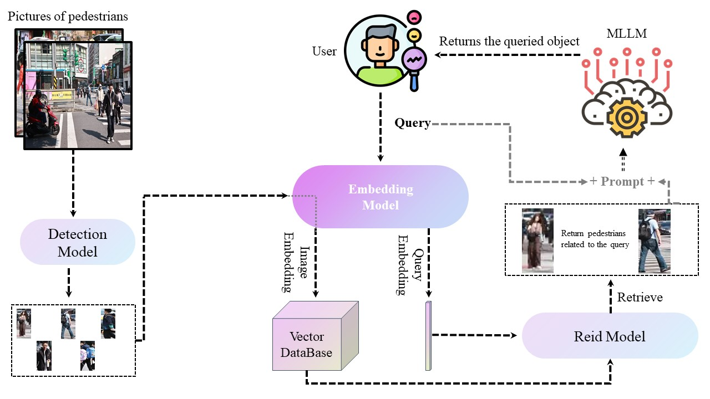

# Text_Based_Person_REID_System
本仓库展示了一个基于文本的行人REID系统. 所有代码即将公布. 

## 更新
- (03/16/2025) 创建了这个仓库,并展示了我们的系统.

## 整体架构设计图

## 演示

点击[这里DeltaAI](http://deltaai.top/)进行观看. 我们由衷的感谢DeltaAI对我们本项目的大力支持.

## 技术栈
- REID模型：IRRA

- 前端：html/css/javascript

- 后端：java

- RAG：LangChain/LlamaIndex

- MLLM：DeepSeek-VL/Qwen-VL

